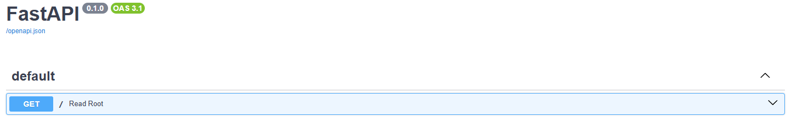
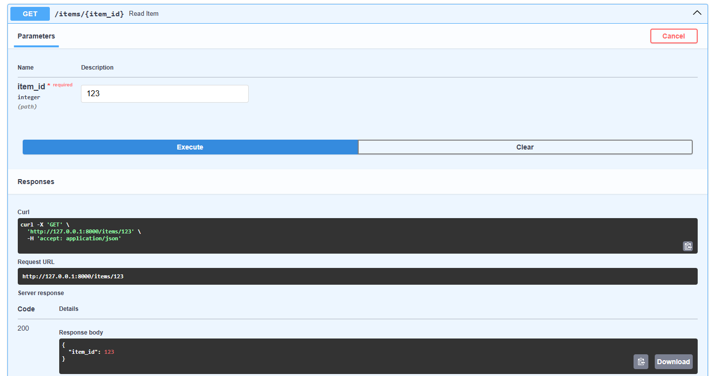

# FastAPI Project #

For this FastAPI Project, I followed along with the following guide with the help of Claude to assist me with any errors and help me learn by defining functions and objects: https://github.com/inanpy/fastapi-getting-started-guide

## Setting up virtual environment ##

First, I created a new folder called **/FastAPI Project/** with **main.py** as my Python file.

Next, I placed the following code in my terminal (Not the Python file itself) to create the virtual environment, called **.venv**.

``` python -m venv .venv ```

The **/.venv/** folder should be in my **/FastAPI Project/** folder now.

Now I can activate my virtual environment with the following code in my terminal:

``` 
.venv\Scripts\activate 
```

## Installing and Running FastAPI and Uvicorn ##

I input the following code to install **FastAPI** and **Uvicorn** from **pip**.

``` 
pip install "fastapi[standard]" "uvicorn[standard]" 
```

Now, FastAPI and Uvicorn functions are imported into the environment. To run Uvicorn:

``` 
python -m uvicorn main:app --reload 
```

**-m** instructs Python to run **uvicorn** as a script that listens for incoming web requests and hands them to FastAPI

In **main:app* (imported from FastAPI), main is the folder name without the .py while app refers to the FastAPI object.

Finally, **--reload** (imported from Uvicorn) is a function that restarts the server whenever a file is saved. Claude instructs that this is for development only and should never be used in production.

This command needs to be used from the terminal to reflect changes onto the API.

## Testing the API ##

To start, I imported the following code as per the guide:

``` 
from fastapi import FastAPI

app = FastAPI()

@app.get("/")
async def read_root():
    return {"message": "Hello!!!"} 
```

**from** and **import** are built-in functions in Python that allow the user to call from a file or package. **from** names the package while **import** identifies what to pull from it. In this case, we are pulling the name **FastAPI** from the package **fastapi**.

In **@app.get("/")**, **@** is a Python syntax that takes the function from FastAPI which is **api.get()**. The **"/"** refers to the name of the directory that the syntax is taking from. 

**async def** (built into Python) is an asynchronous function that makes a function wait for another code to execute.

**return** is another built-in function from Python that prints the subsequent text, in which case is **{"message": "Hello!!!"}**. The **{}** brackets encases a key-value pair inside with a **:** in between the pair. A key-value pair is a way in which a value can be labelled for future reference. In this case, **message** is the label while **Hello!!!** is the content In doing so, it instructs Python to convert it to a **JSON** file. JSON is a format by which applications can communicate with each other through. This keeps code interoperable especially when it comes to APIs.

Click CTRL+S to save the file to reflect the changes.

## Testing FastAPI on browser ##

Any time the API has been changed, it will reflect in **http://127.0.0.1:8000/** on the browser.

When I go to the URL, the following appears:


You may also go to **http://127.0.0.1:8000/docs** to view the documentation including the directories that FastAPI generates automatically:



## Path and Query Parameters ##

As per the guide, I input the following code:

```
@app.get("/items/{item_id}")
async def read_item(item_id: int):
    # 'item_id' is taken from the path and converted to int
    return {"item_id": item_id}
```

This line of code will ask FastAPI to call whatever item ID is being input and pass it into our function. Now, we have identified **/items/{item_id}** as our endpoint and defined read_item() as our functioning for reading the items. **(item_id: int)** refers to the item ID that is being called followed by an integer. Finally, FastAPI will **return** the variable item ID followed by the integer item ID which will reflect the number on the variable.

Now, if we save and go back to the documentation browser for FastAPI through http://127.0.0.1:8000/docs, we will see a new object called **/items/{item_id}** which is described as **Read Item**. If we click "Try It Out" to test this feature, it will ask us to input an **item_id**, in which case I used ***123*** to try it out which yields the following:


