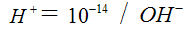
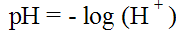
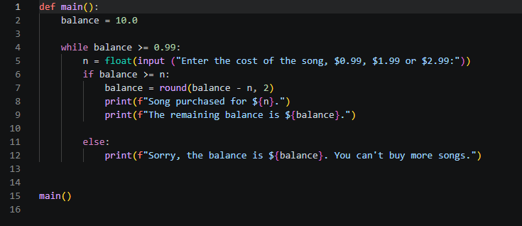
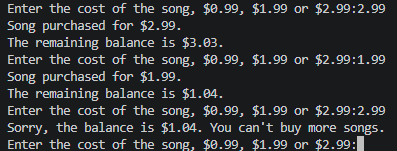
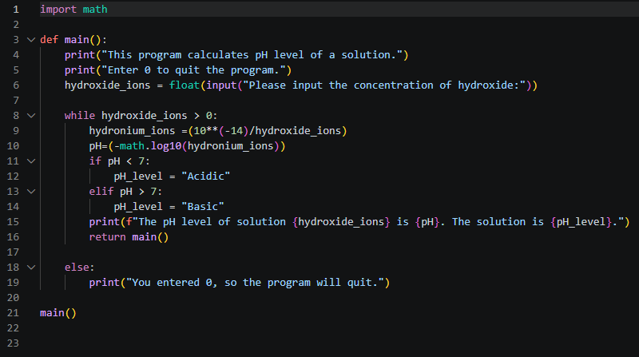
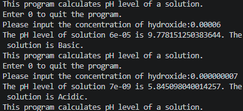
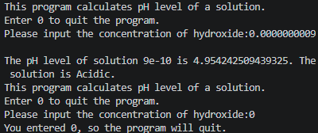

# Loop Structures Lab #

## Learning Outcomes ##
- While loop/else
- Math import
- Variable Assignment
- Return function to break loop
- f-statement

## Lab Question ##

For this lab, I followed the instructions from the [Loop Structures](https://www.labs.cs.uregina.ca/165/loops/index.html#for) section of the University of Regina's CS/STAT 165 course. For documentation purporses, I included the instructions below.

### 1. Online Music Store ##

For your birthday, you received a $10 gift certificate for an online music store. The cheapest song in the store costs $0.99. You can buy songs until you can't afford any more songs.

*Requirement*

- Complete the Python program music_store.py that allows a user to repeatedly buy songs from an online music store.

- Set an initial balance of $10.

- Use a loop to keep asking the user to buy songs while there's at least enough balance to afford the cheapest song.

- For simplicity, just enter the cost of a song from the user and ignore the song and artist name.

- Check to see if the user can afford the song before completing the purchase. Make sure that negative balances will not happen.

- Give feedback to the user indicating whether their purchase was successful and how much money they have left.

- When the loop ends, display a goodbye message with the remaining balance.

*Sample output:*

Enter the cost of the song, $0.99, $1.99 or $2.99: 0.99
Song purchased for $ 0.99; enjoy!
The remaining balance is 9.01

Enter the cost of the song, $0.99, $1.99 or $2.99: 1.99
Song purchased for $ 1.99; enjoy!
The remaining balance is 7.02

Enter the cost of the song, $0.99, $1.99 or $2.99: 2.99
Song purchased for $ 2.99; enjoy!
the remaining balance is 4.03

Enter the cost of the song, $0.99, $1.99 or $2.99: 1.99
Song purchased for $ 1.99; enjoy!
The remaining balance is 2.04

Enter the cost of the song, $0.99, $1.99 or $2.99: 2.99
Your choice is too expensive. Choose another song.
The remaining balance is:2.04

Enter the cost of the song, $0.99, $1.99 or $2.99: 1.99
Song purchased for $ 1.99; enjoy!
The remaining balance is 0.05

Sorry, the balance is $ 0.05. You can't buy more songs.

### 2. Complete the program ph_level.py to determine the pH of a solution. ###

A solution with a pH level less than 7 is acidic; otherwise, it is basic. Determining the pH of a solution is important, since many organisms and micro-organisms can only live in a limited pH range.

*Instructions:*

Request an input for a concentration of hydroxide ions, denoted OH −
Calculate the concentration of hydronium ions, abbreviated H +, using this formula:



Calculate the pH level from the hydronium concentration with this formula:



Your program should print something like this:

*Sample Output:*

This program calculates pH level of a solution.
Enter 0 to quit the program.
Please input the concentration of hydroxide: 0.002
The ph level of solution 0.0020000000 is 11.3010299957. The solution is basic.

Please input the concentration of hydroxide: 0.00006
The ph level of solution 0.0000600000 is 9.7781512504. The solution is basic.

Please input the concentration of hydroxide: 0.000000007
The ph level of solution 0.0000000070 is 5.8450980400. The solution is acidic.

Please input the concentration of hydroxide: 0.0000000009
The ph level of solution 0.0000000009 is 4.9542425094. The solution is acidic.

Please input the concentration of hydroxide: 0
You entered 0, so quit the program.

## Details ##

For this lab, I first wrote the code myself then used Claude to help with corrections and learn additional information.

### 1. music_store.py ###

First, I defined the code as `main()` for when it runs.

I simply set the default balance to 10.0 with `balance = 10.0`. Afterwards, I introduced the `while` function to indicate that the loop will continue so long as the balance is higher than 0.09 which is the cost of the lowest song. Therefore, while the balance is still able to purchase any item in the list, then the loop can still run. The `while` statement would keep the code running until it breaks once the balance is not enough to purchase anything.

```python
while balance >= 0.99:
```

I assigned the input to the variable `n` which asks the user to enter the cost of the song amongst three different possible options: $0.99, $1.99, $2.99. For the purpose of this lab, I did not include an option for if the user inputs a number outside of these three options.

```python
n = float(input ("Enter the cost of the song, $0.99, $1.99 or $2.99:"))
```

I introduced the `if` statement which indicates that a conditional will occur if the balance is equal to or higher than the input. Once the user inputs the cost of the song, it will subtract the input from the balance. Something that was not included in this tutorial is the `round()` function which rounds a floating number to a specified decimal. In this case, I typed `(balance - n, 2)` to indicate that it will round to two decimal places.

```python
balance = round(balance - n,2)
```

Now, for the `print()` functions to print the output for the user, I used f-statements which allow me to input the variables into the sentences using `{}` brackets.

Finally, for the `else` statement, if the balance is not enough to purchase anything, then it will inform the user with a print statement. Because the balance is lower than 0.99, then the while statement will break automatically and return back to main().

```python
 else: 
    print(f"Sorry, the balance is ${balance}. You can't buy more songs.")
```

To close out the code, I finalized with main() which will run the code.



Here's how the code works when I run it:



### 2. ph_level.py ###

Because `log` function will be involved, I imported the `math` library which includes the function.

I defined the code as `main()` for when it will run.

First, I made two `print()` functions to instruct the user for what the program was used for as per the requirements of the lab.

```python
print("This program calculates pH level of a solution.")
print("Enter 0 to quit the program.")
```

I assigned the concentration of hydroxide ions to `hydroxide_ions` which is a variable that will match the input of the user.

```python
hydroxide_ions = float(input("Please input the concentration of hydroxide:"))
```

Then, I introduced a `while` statement which creates a loop so long as `hydroxide_ions` is larger than 0.

I defined the concentration of hydronium ions as `hydronium_ions` which is the result of the formula provided in the instruction lab. `**` is the substitute for `^` in Python which represents the power of a number.

```python
hydronium_ions =(10**(-14)/hydroxide_ions)
```

Afterwards, I defined pH using the variable `pH` which will use the method of the math library that was imported earlier. The `log10` method from the math library will be used. As such, the syntax would be `math.log10()`. The `10` is because the log is in base of 10.

```python
pH=(-math.log10(hydronium_ions))
```

Now, I introduced an if statement to represent a condition that if the pH is less than 7, then the variable of `pH_level` will be `Acidic`. I also introduced an `elif` which is the other condition in which if the `pH_level` is more than `7`, then the variable of `pH_level` will be `Basic`.

```
if pH < 7:
     pH_level = "Acidic"
 elif pH > 7:
      pH_level = "Basic"
```

Now, the loop will end off by printing a statement which tells the user the concentration of hydroxide ions as inputted earlier followed by the pH level. The statement will also tell the user if the solution is `Acidic` or `Basic`.

The statement `return main()` will reset the loop and ask the user to input the concentration of hydroxide ions all over again.

The code also has an `else` statement. If the `hydroxide_ions` variable is `0` as inputted by the user, then it will print a statement informing the user that the program will quit. This would end the running code.

```python
else:
    print("You entered 0, so the program will quit.")
```



Here's the code at work:



