# TryHackMe - Elastic Stack: The Basics #

I completed TryHackMe's Elastic Stack: The Basics room which teaches the fundamentals of ELK Stack, also known as ElasticSearch LogStash Kibana (ELK).

ElasticSearch provides the database parsing functionality, LogStash collects data from forwarders through endpoints, and Kibana provides the user interface to analyze the data.

## Accessing Elastic ##

I used TryHackMe's virtual machine and copied the dedicated IP address into the browser, then entered the provided username and password to access the instance of Elastic where the lab will take place.

## Task 4 - Discover Tab ##

Here, I explored Elastic's Discover tab.

1) *Select the index vpn_connections and filter from 31st December 2021 to 2nd Feb 2022. How many hits are returned?*

On the top right-hand side of the interface, there is a date range that I can set. 

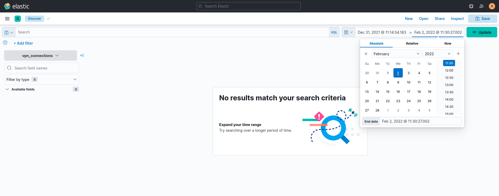

By choosing "Absolute" under the date setting, I can select the exact start and end dates for my range.

As such, I will get 2,861 hits which will be the answer.

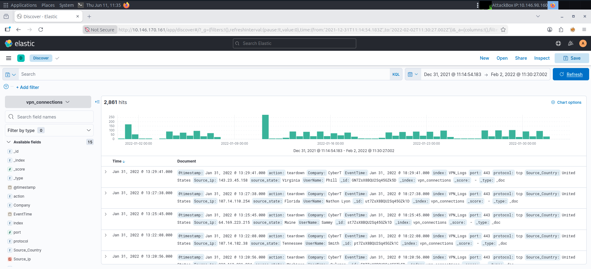

2) *Which IP address has the maximum number of connections?*

One cool part about Elastic is the ability to click on any of the fields to see the top values within a field.

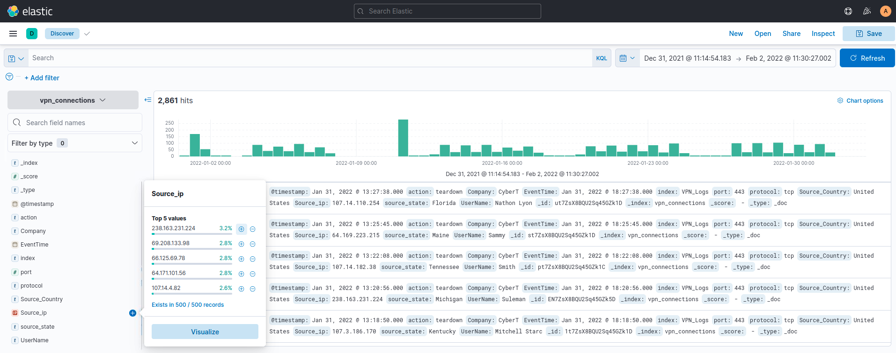

If we click on the "Source_ip" field, we can see that 238.163.231.224 has 3.2% of all of the VPN Connections. As such, this IP address is the answer to this question.

3) *Which user is responsible for the overall maximum traffic?*

Same as the previous question, this time we click on the "UserName" field, which gets us James at 4.0% of all VPN Connections.

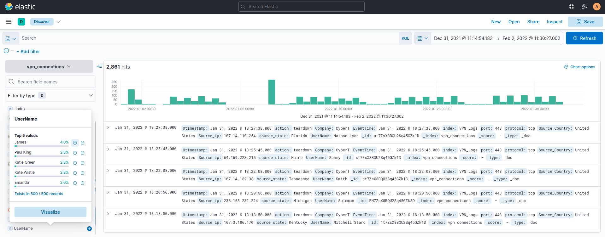

4) *Apply Filter on UserName Emanda; which SourceIP has max hits?*

ELK uses Kusto Query Language (KQL) for its searches, different from Splunk with SPL. Instead of the "=" sign which we normally use for SPL, KQL uses ":" instead. Here, we will search using 'UserName:"Emanda"'. Then, we do the same thing as before and click on the "Source_ip" field which gets us the answer of 107.14.1.247.

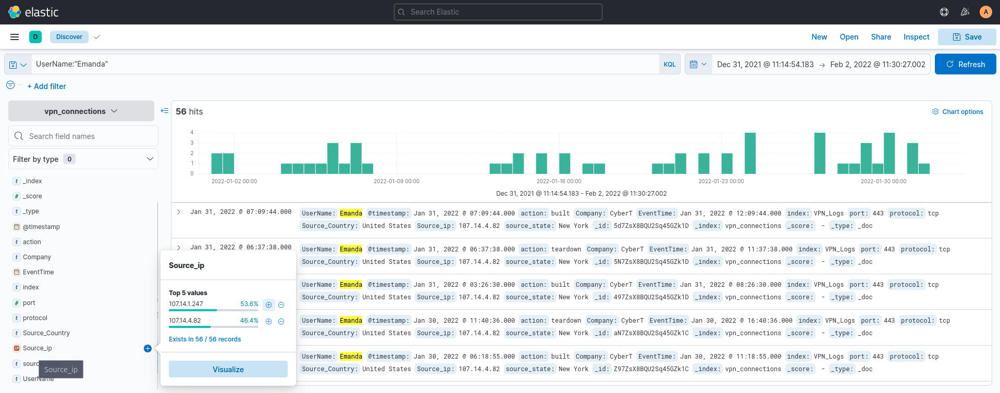

5) *On 11th Jan, which IP caused the spike observed in the time chart?*

Another cool feature about ELK is the option to click on one of the bars in the timeline to filter for a specific date. In this case, we click on the January 11, 2022, bar.

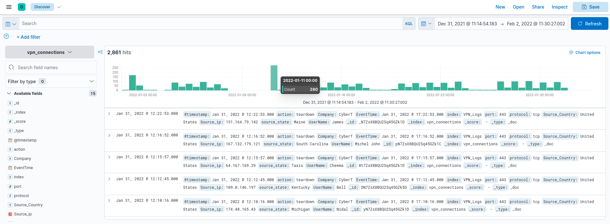

Afterwards, we simply check for the Source_ip and get the answer of 172.201.60.191.

6) *How many connections were observed from IP 238.163.231.224, excluding the New York state?*

Here, we have to use the Boolean logic to input two search parameters while excluding New York. We use the following search: Source_ip:"238.163.231.224" AND source_state:(NOT "New York").

KQL is different from SPL here in the sense that the user would need to first input the field followed by a bracket to contain the search terms. Then, the Boolean operator NOT would need to be included within the brackets.

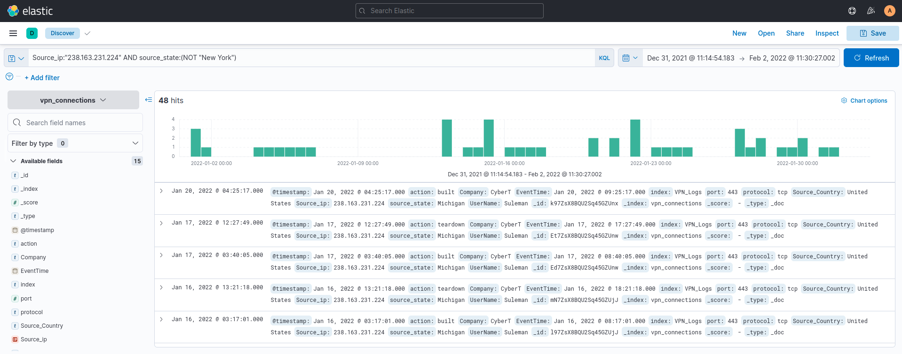

This would get us the answer of 48.

7) *Create a table with the fields IP, UserName, Source_Country and save.*

On Elastic, it is possible to create a table that filter out fields for only the ones you want to see by clicking the + sign next to each field.

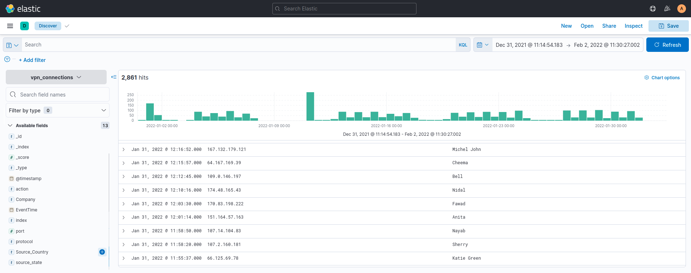

Here is our table for the question.

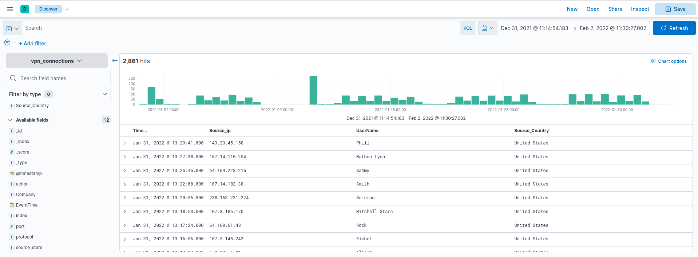

Now that we have our table, we will save it as "VPN Connections (IP, UserName, Country)" and that will be all the questions for this task.

## Task 5 KQL Overview ##

1) *Create a search query to filter the logs where Source_Country is the United States and show logs from User James or Albert. How many records were returned?*

We can search using the following parameters: Source_Country:"United States"  AND UserName:("James" OR "Albert")

This will get us the answer of 161.

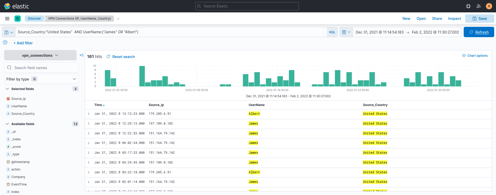

2) *A user Johny Brown was terminated on the 1st of January, 2022. Create a search query to determine how many times a VPN connection was observed after his termination.*

Using what we learned before, we search for Johny Brown using the "UserName" field then set the starting date to January 1, 2022 and end date to Now. Doing this will get us the answer of 1.

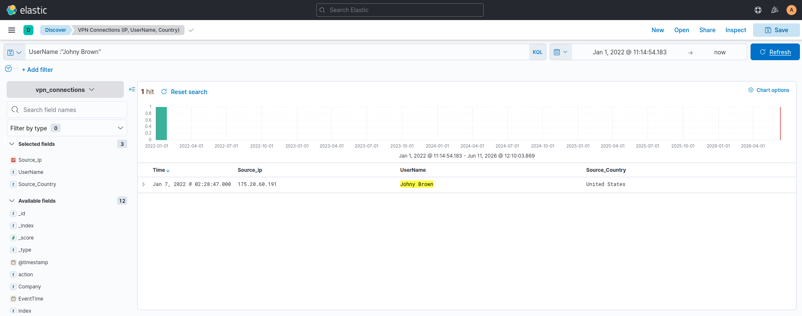

## Task 6 - Creating Visualizations ##

1) *Which user was observed with the greatest number of failed attempts?*

To create a graph or chart, we begin by click on a field then clicking the "Visualize" button. In this case, we're working with UserName so I clicked that field.

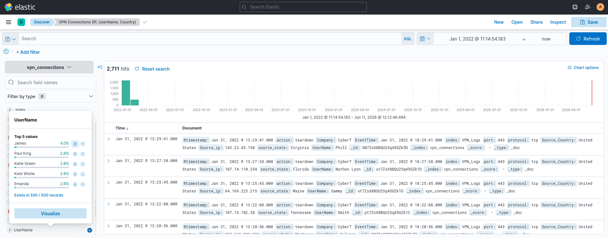

Here, I dragged the "action" field in, which represents different states of VPN access. The different actions are built, failed, and teardown. In this case, we don't need built and teardown. Within the chart, there is a triple dot next to each item which gives us the option to filter them out. 

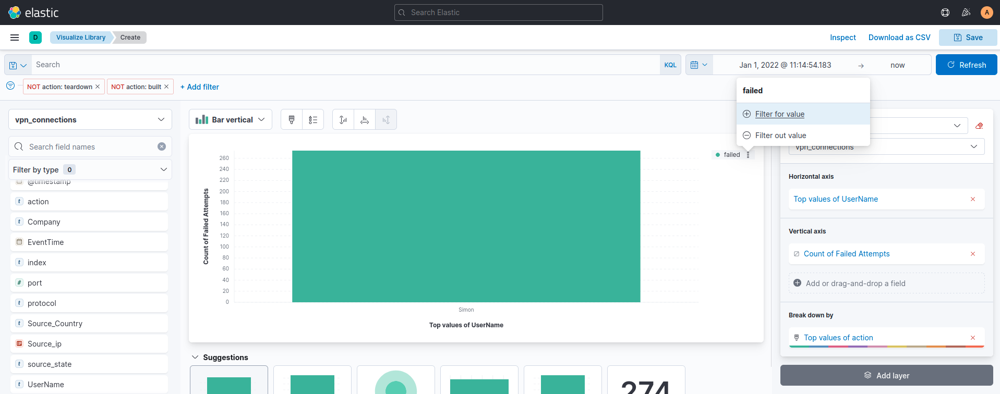

Otherwise, it is possible to add a filter under the search bar, and search 

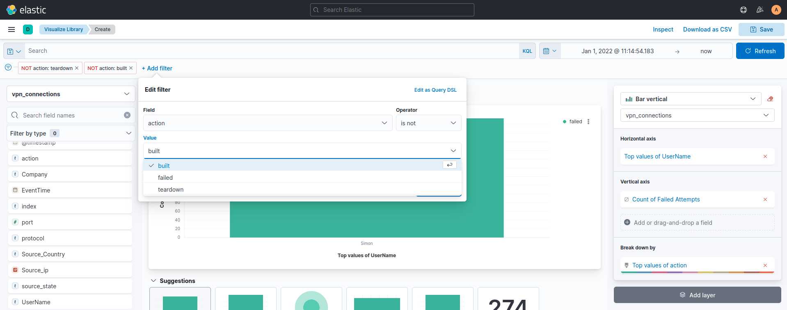

We will get the answer that Simon is responsible for the most failed attempts. If we want to get fancy, we can also rename the axis in the visualization. To demonstrate, I renamed the vertical axis to "Count of Failed Attempts."

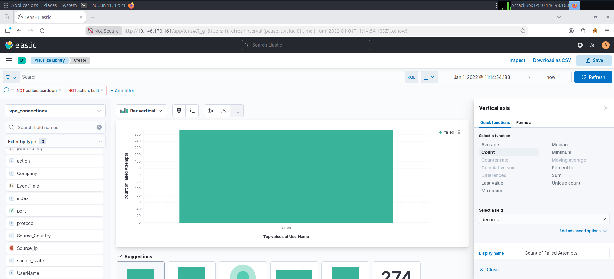

2) *How many wrong VPN connection attempts were observed in January?*

This question is a bit strange and initially threw me off. If we drag the "@timestamp" field in, it will give us only one date of December 29, 2021, which has failed attempts. That certainly isn't in January.

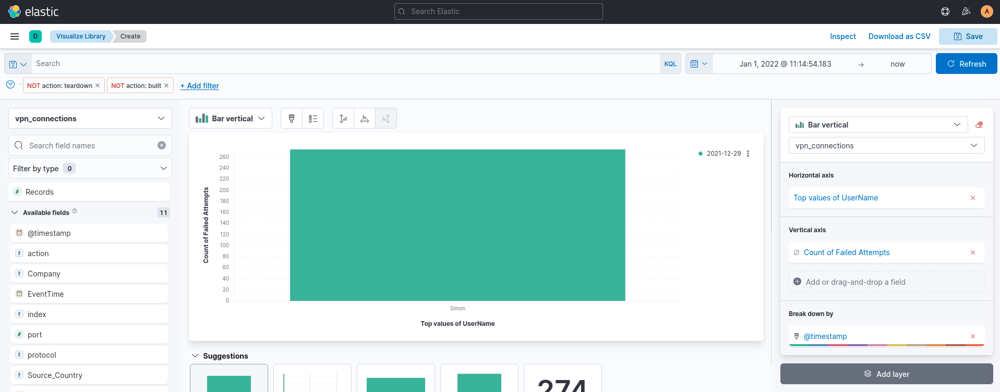

Regardless, if we type the answer of 274 in, it is correct either way.