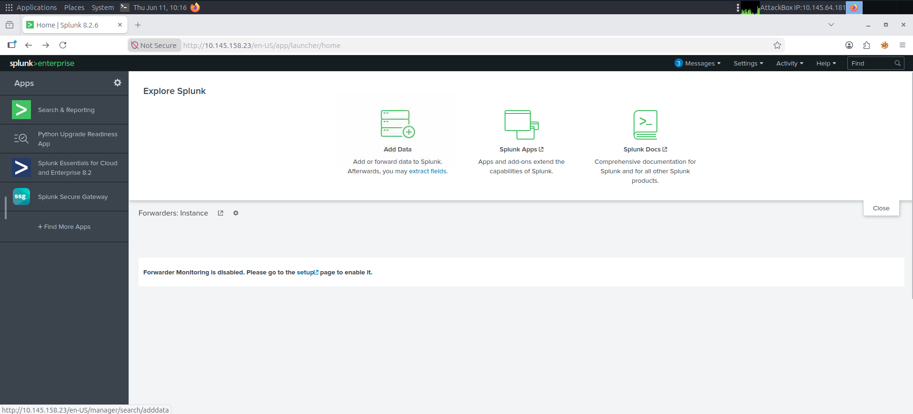
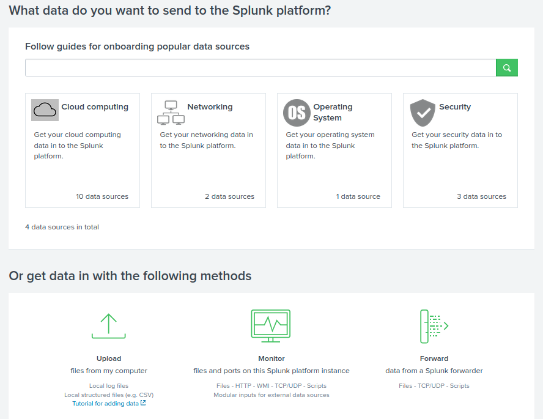
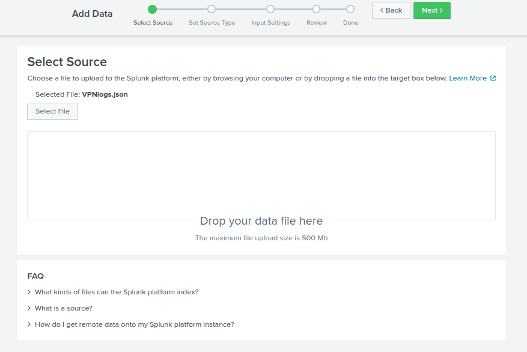
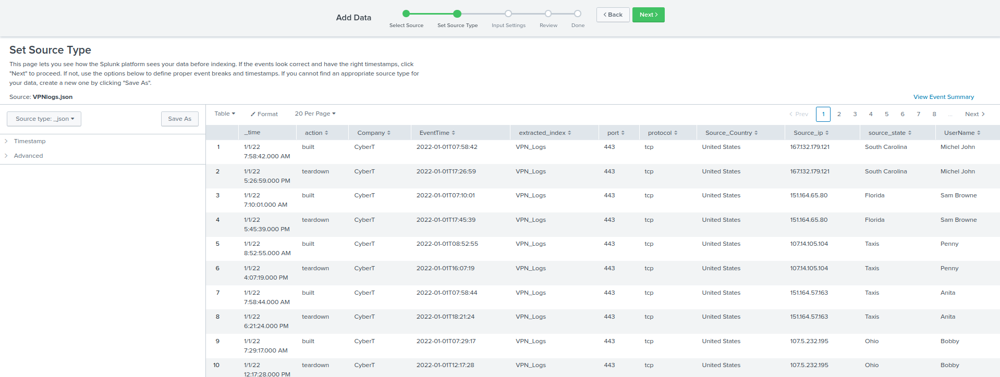
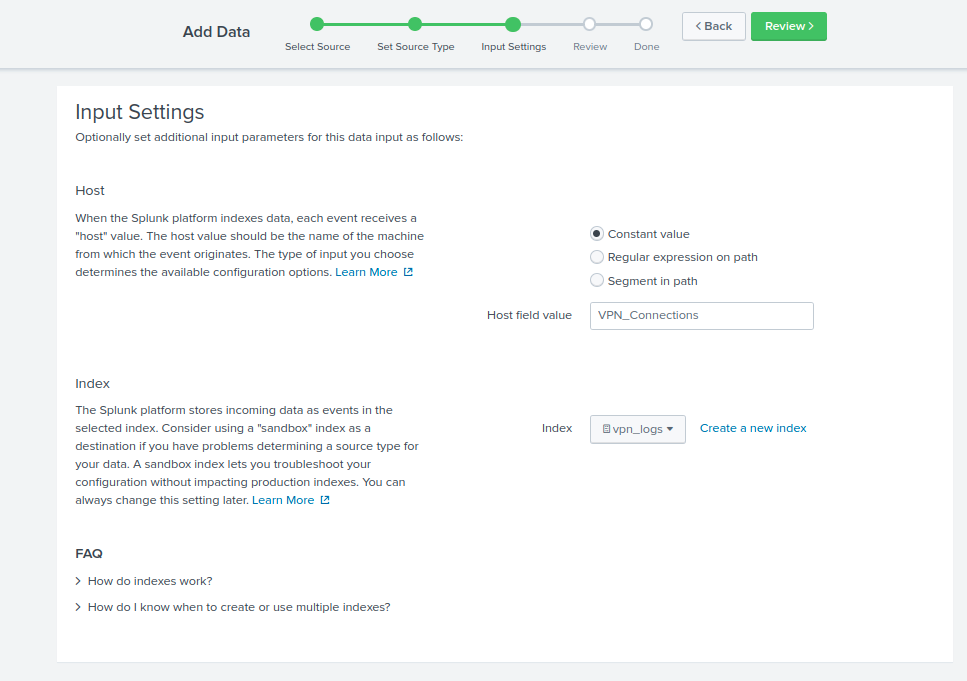
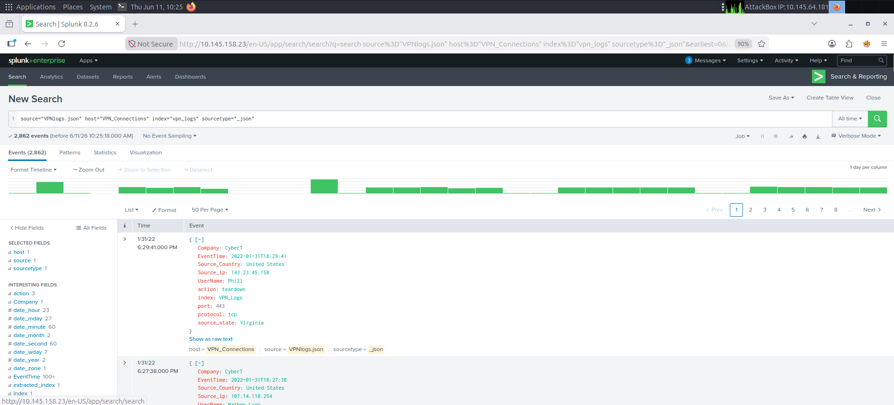
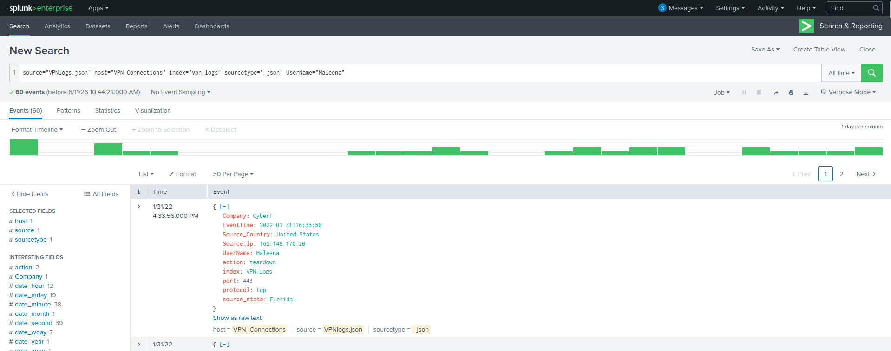
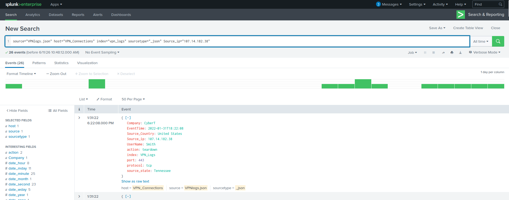
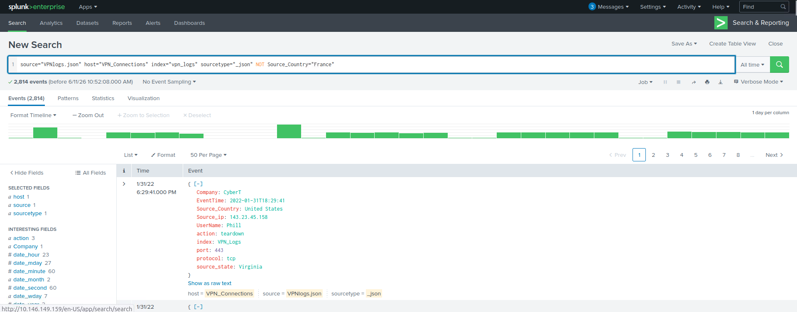
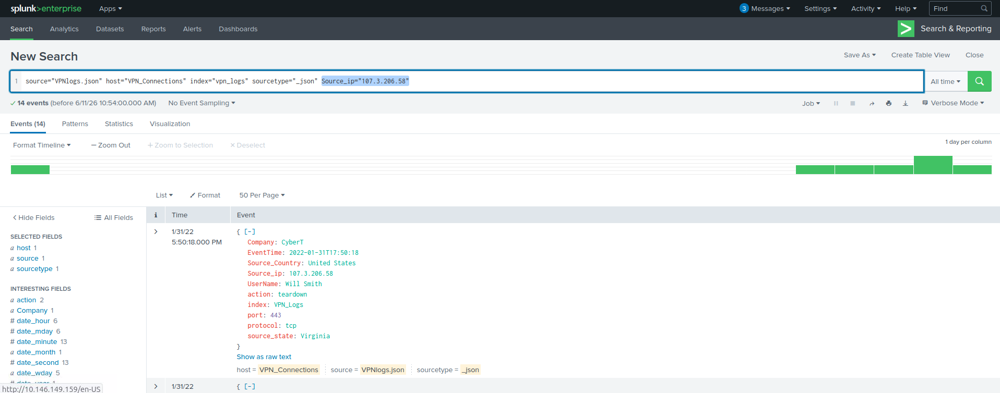

# TryHackMe - Splunk the Basics #

In this lab, I completed the Splunk: The Basics room in TryHackMe which teaches the fundamentals of using the Security and Information Event Management tool known as Splunk.

## Learning Outcomes ##

-Splunk Navigation
-Splunk Processing Language (SPL)
-Splunk Add Data functionality

## Connecting to Splunk ##

First, I spun Splunk up on TryHackMe's Virtual Machine by entering the dedicated IP address that was provided to me into the browser.

## Uploading the Log files ##

On TryHackMe's virtual machine, there is a log fil called VPN_logs under /root/Rooms/SplunkBasic/.

On Splunk's main landing page, there is an option to add the log files under "Add Data".

From this screen, there is either the option to add data through forwarders or through manual upload. Here, I chose the option to "Upload" the data from the virtual machine. 

From here, I can set the source type. For the purpose of this lab, I am keeping the source type to _JSON for .JSON files, which these logs are.

Additionally, I changed the host field value to VPN_Connections which should match the name of the machine in the log file. As per one of the questions in the lab, I created a new index called "vpn_logs" and set the index to it.

   

Afterwards, I hit submit and began parsing the log files through Splunk.

## Task Questions ##

1) *Upload the data attached to this task and create an index "VPN_Logs". How many events are present in the log file?*

Immediately, we can see that there are a total of 2,862 events in this log file.

2) *How many log events are captured by the user Maleena?*

One of the available fields in the log files is "UserName". Using this, we may conduct a Splunk Processing Language (SPL) search through 'UserName="Maleena"'. 

Here, we get 60 log events.

3) *What is the username associated with IP 107.14.182.38?*

Here, like the previous question I used SPL again. From the available fields, we can see one called "Source_ip". As such, I searched 'Source_ip="107.14.182.38"' (case-sensitive).

We get a UserName identified as "Smith."

4) *What is the number of events that originated from all countries except France?*

For this question, we need to use Boolean logic to EXCLUDE France. There is a field called "Source_Country" so we'll use that. First, we introduce NOT followed by the standard search of 'Source_Country="France"' to accomplish this.

So, doing this will get us 2,814 log events.

5) *How many VPN events were associated with the IP 107.3.206.58?*

Now that we know SPL, this is an easy question to wrap things up. We search using 'Source_ip="107.3.206.58"'.

The answer to this final question is 14.
