# TryHackMe - Summit #

## Objective (from TryHackMe) ##

After participating in one too many incident response activities, PicoSecure has decided to conduct a threat simulation and detection engineering engagement to bolster its malware detection capabilities. You have been assigned to work with an external penetration tester in an iterative purple-team scenario. The tester will be attempting to execute malware samples on a simulated internal user workstation. At the same time, you will need to configure PicoSecure's security tools to detect and prevent the malware from executing.

Following the Pyramid of Pain's ascending priority of indicators, your objective is to increase the simulated adversaries' cost of operations and chase them away for good. Each level of the pyramid allows you to detect and prevent various indicators of attack.

## Details ##

Each time we complete a level, we will need to use a different method for the subsequent levels.

### sample1.exe ### 

First, we can run a scan of sample1.exe with the built-in simulation malware sandbox.

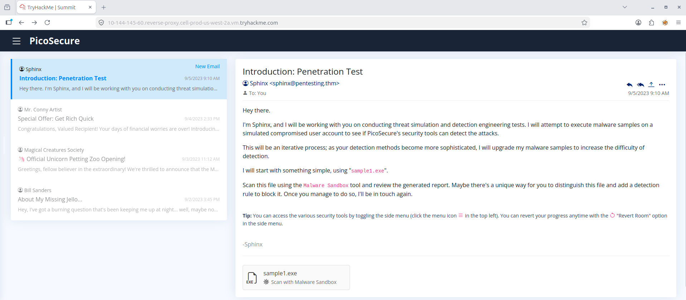

Here are the details of sample1.exe.

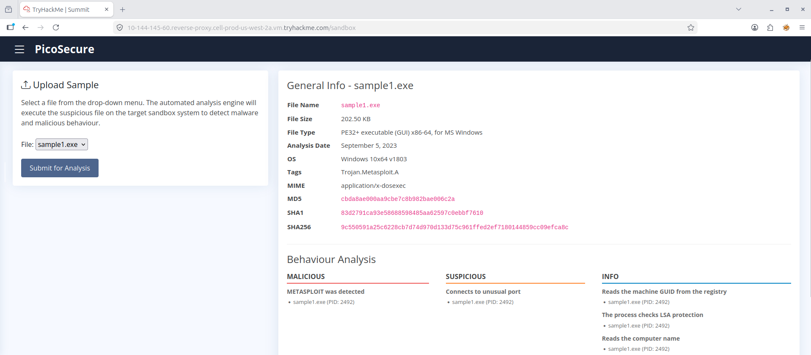

We can then add the SHA256 hash value of the sample1.exe to our hash blocklist. Then we will get our first flag.

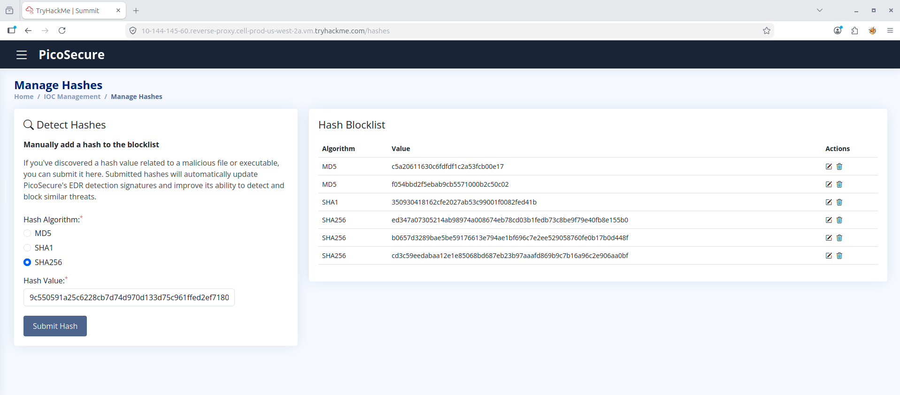

### sample2.exe ###

Now for sample2.exe, we run the same scan.

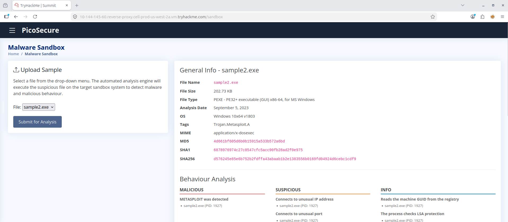

Since the process first connects to an IP address, we may block that IP address instead of the hash method we used last time.

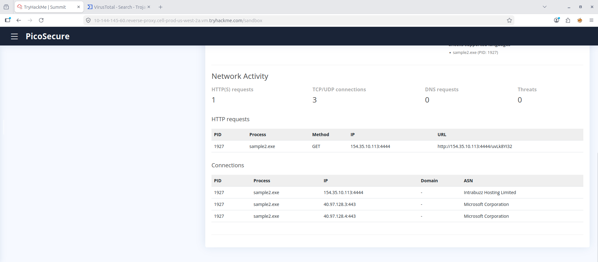

Since it connects to the IP Address outside, we would need to set it to egress and prevent ANY of our devices from connecting to the IP Address of: 154.35.10.113.  Afterwards, we will receive our flag.

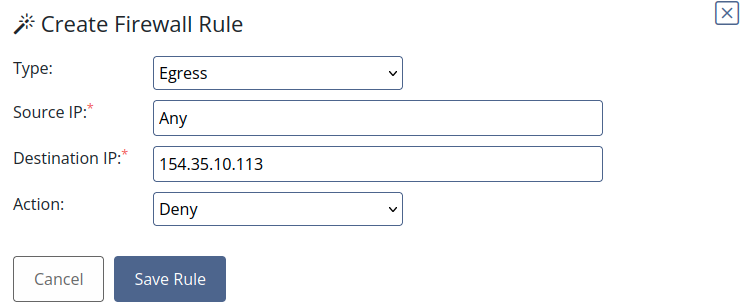

### sample3.exe ###

For sample3.exe, we can see that the file connects to a suspicious website. Let's try blocking that website using the DNS Rule Manager.

Upon analysis, we notice that the file makes us connect to a domain called "emudyn.bresonicz.info".

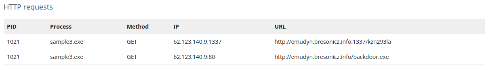

We can then create a DNS rule that blocks connection to that URL and then we will receive our flag.

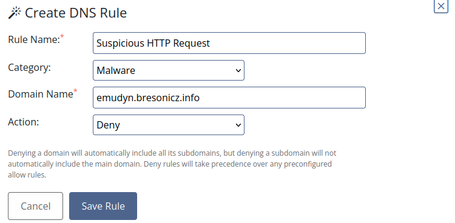

### sample4.exe ###

We'll notice that in this file, it writes registry modifications.

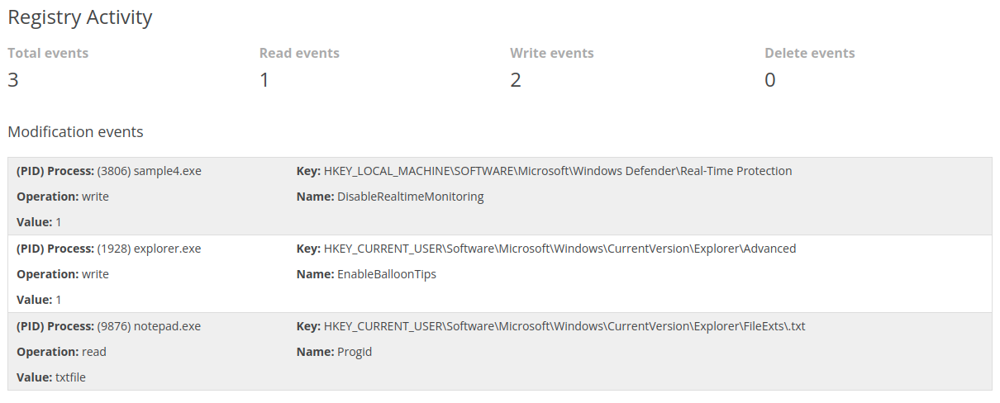

We can add a rule against this sort of registry modification by filling out the fields accordingly. Since the registry modification is to disable real-time modification, this is considered an act of Defense Evasion under the MITRE ATT&CK framework. Afterwards, we will receive our key.

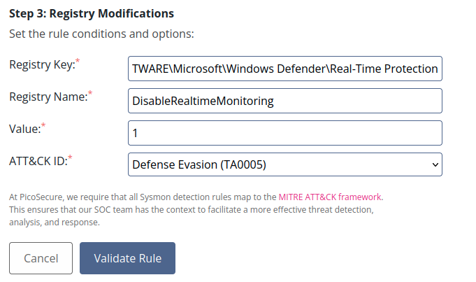

### sample5.exe ###

For this file, we will need to review the outgoing_connections.log file that was sent to us. Based on the logs, we see a large frequency of 97 bytes connection followed by a transmission of large bytes through port 80 to various different IP addresses.

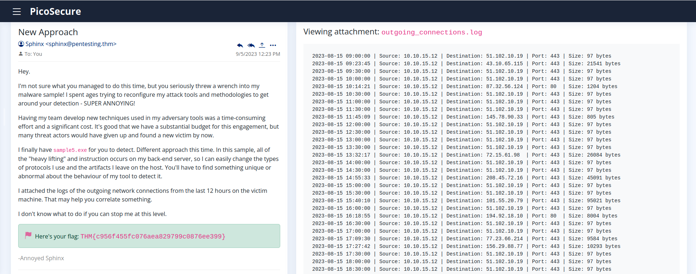

We will notice that the file makes a high number of consequitive connecions to a beacon.bat file which may suggest that this a command control file made to compel infected hosts to connect to other addresses.

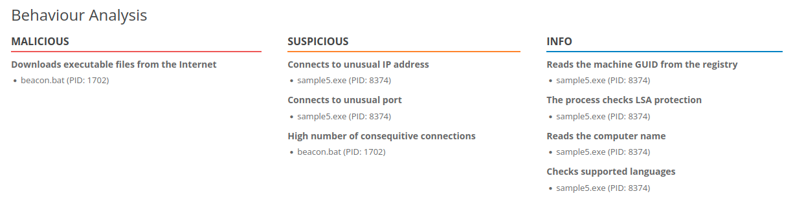

We can set a rule for Network Connections to block a connection to any remote IP (the IP address may change if it is adjusted by the attacker) through any port (also can be adjusted by attacker), with a byte size of 97. The frequency of the 97 byte connections is every 30 minutes, so we can put 1800 seconds under the frequency. Given the mode of operation, we can see that this is a Command and Control tactic under the MITRE ATT&CK. We will then receive our flag.

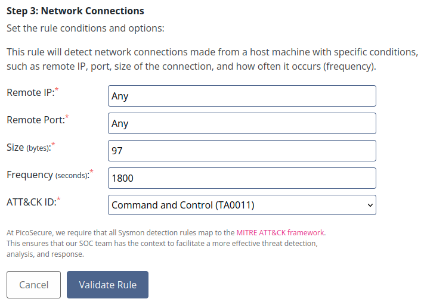

### sample6.exe ###

For this file, we will need to review the commands.log file attached in the email.

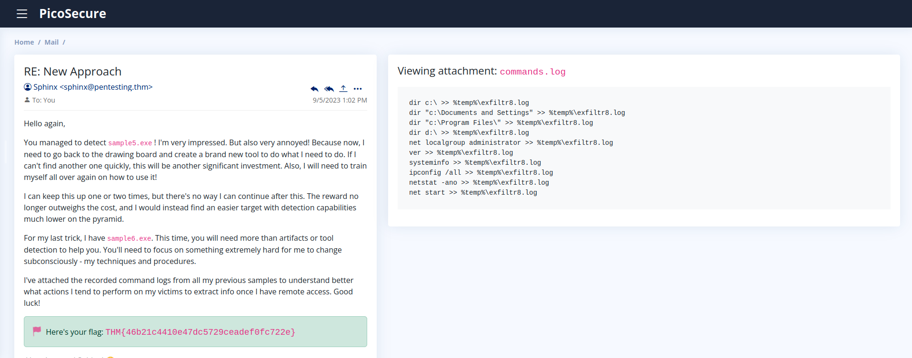

Easily, we can see that the problem file is the exfiltr8.log which comes out of the file path of %temp%. In the email, the sender stated that the purpose of this sample is to extract info. As such, this would fall under Exfiltration under MITRE ATT&CK. We would then get the flag to the final level.

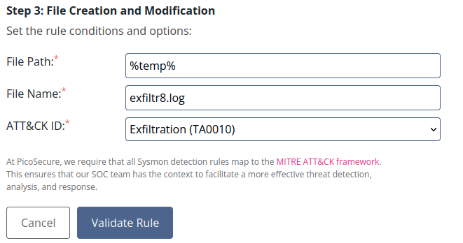

